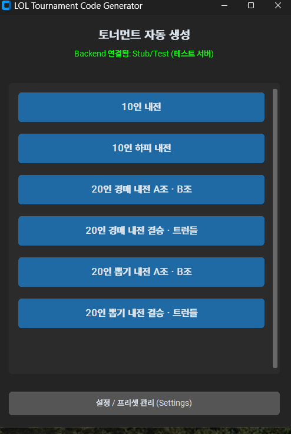

# LOL Tournament Code Creator

League of Legends Tournament Code Generator & Manager.  
리그 오브 레전드 사설 대회(커뮤니티 토너먼트) 운영을 위한 **토너먼트 코드 자동 생성 및 관리 도구**입니다.

---

## 📄 Documentation (법적 고지 및 보안)
본 프로젝트는 Riot Games의 보안 정책(Security Policy)을 준수합니다. 사용자의 API Key를 절대 요구하지 않으며, 모든 통신은 보안 백엔드를 통해 안전하게 보호됩니다.
*   [Privacy Policy (개인정보 처리방침)](./privacy.md)
*   [Terms of Service (이용약관)](./tos.md)

---

## 📌 Features (주요 기능)

*   **Secure API Architecture**: 사용자의 API 키 입력 없이, 보안 백엔드를 통해 안전하게 토너먼트 코드를 생성합니다.
*   **Automated Code Generation**: Riot API (Tournament V5)를 이용하여 대회 코드를 쉽고 빠르게 생성합니다.
*   **Preset Management**: 자주 사용하는 대회 설정(팀 크기, 맵, 밴픽 방식 등)을 프리셋으로 저장하여 원클릭으로 코드를 발급받으세요.
*   **Discord Integration**: 생성된 코드를 Discord Webhook을 통해 운영진 및 참가자 채널로 즉시 전송합니다.
*   **GUI & CLI Support**: 직관적인 GUI(CustomTkinter)와 가벼운 CLI 모드를 모두 지원합니다.

## 📸 Screenshots (실행 화면)

| 메인 화면 (Main GUI) | 일반 설정 (General Settings) |
|:---:|:---:|
|  |  |
| **토너먼트 생성 및 코드 발급** | **환경 설정 및 Provider 관리** |

| 프리셋 관리 (Preset Manager) | 수동 설정 (Manual Config) |
|:---:|:---:|
|  |  |
| **대회 프리셋 및 웹훅 설정** | **개별 토너먼트 수동 생성** |

## 🛠 Tech Stack

*   **Language**: Python 3.11+
*   **GUI Framework**: CustomTkinter
*   **API**: Riot Games Tournament API (via Secure Backend)

## 🚀 How to Use (사용 방법)

### 1. 프로그램 다운로드 (가장 권장)
심사관 및 일반 사용자는 빌드된 실행 파일을 다운로드하여 별도의 설치 없이 바로 사용할 수 있습니다.
*   **[최신 EXE 다운로드 (Direct)](https://github.com/ganada001/LOL_Tournament_Code_Creator/raw/main/dist/LOL_Tournament_Code_Creator.exe)**
*   다운로드 후 `LOL_Tournament_Code_Creator.exe`를 실행하세요.

### 2. 소스 코드에서 실행 (개발자용)
1.  **Clone**: `git clone https://github.com/ganada001/LOL_Tournament_Code_Creator.git`
2.  **Dependencies**: `pip install -r requirements.txt`
3.  **Run**: `python gui_main.py`

## ⚠️ Requirements

*   Python 3.11+
*   Discord Webhook URL (Optional)

---
---
> [!NOTE]
> **Legal Disclaimer**  
> `LOL Tournament Code Creator` isn't endorsed by Riot Games and doesn't reflect the views or opinions of Riot Games or anyone officially involved in producing or managing Riot Games properties. Riot Games, and all associated properties are trademarks or registered trademarks of Riot Games, Inc.
